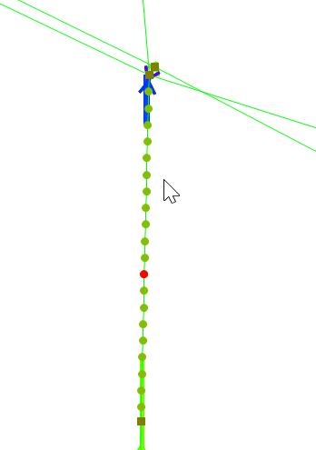

# Node Insertion and Pipe Reprojection Script for InfoWorks ICM

This SQL script inserts new nodes into an existing pipe in an InfoWorks ICM model network and reprojects the pipe to include these new nodes.

## How it Works

The script operates in several steps:

1. **Selection of Pipe**: The script selects a pipe and identifies its upstream and downstream nodes.

2. **Retrieval of Node Details**: The script retrieves the X and Y coordinates of the upstream and downstream nodes, as well as other associated parameters like ground level, system type, and pipe shape, width, and height.

3. **Calculation of Pipe Vector**: The script calculates the vector of the pipe based on the X and Y coordinates of the upstream and downstream nodes.

4. **Node Insertion Loop**: The script enters a loop where it inserts new nodes at a fixed chainage distance along the pipe until the length of the pipe is exceeded. The new nodes are inserted with the same system type and ground level as the original upstream node.

5. **Pipe Reprojection Loop**: The script enters another loop where it reprojects the original pipe to include the new nodes. It creates new pipe segments between each pair of consecutive nodes along the original pipe.

## Usage

To use this script, simply run it in the context of an open network in InfoWorks ICM. The script will automatically insert new nodes into the selected pipe and reproject the pipe to include these new nodes.

