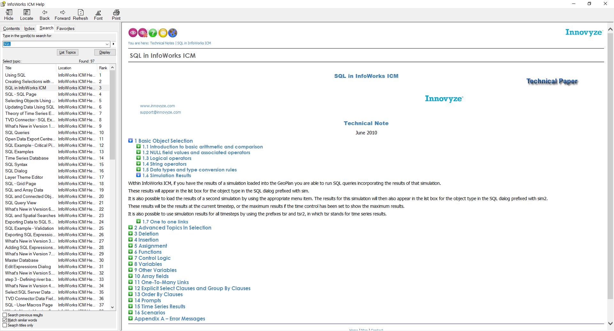

# SQL in InfoWorks ICM
InfoWorks ICM implements its own subset of SQL (Structured Query Language) for selecting and updating network objects using specified criteria. 

An SQL query consists of a number of clauses separated by semi-colons. Each clause can do one of the following:
    Select objects 
    Deselect objects 
    Update fields in objects 
    Clear the selection

The SQL query is built on the SQL Dialog. To open the dialog, choose SQL select... from the Selection menu, or click the  button from the Selection toolbar.

There is considerable resource already contained within the ICM Help (press F1) to assist users with SQL and to understand the available functionality. This should be the first place to investigate and understand what is possible. This repository is designed to provide practical examples and to show working syntax based on historic requests we have had from customers. 

## InfoWorks ICM Help - SQL in InfoWorks ICM

## Community input welcome!
If you have any great SQLs that you would like to share with the modelling community then please provide them to support@innovyze.com and we will try and get them uploaded as soon as possible. Additionally if you make any enhancements to our scripts or find any bugs then please let us know. 

Together we grow!