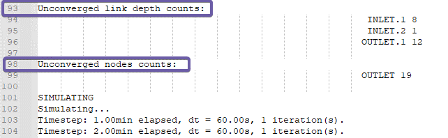
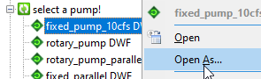
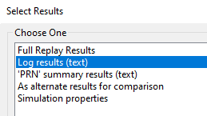
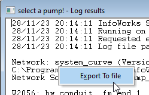
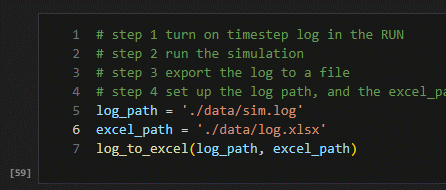
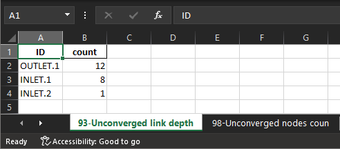

# Timestep_log_file_reader

The timestep log is very useful When debugging an InfoWorks ICM model, however, the log file usually will have thousands of lines and extracting the useful information can be a challenge.

The “timestep_log_file_reader.ipynb” can extract the count tables showing the nodes and links with trouble in calculation into an Excel spreadsheet.

Here are a few example tabs,

- 93-Unconverged link depth

- 98-Unconverged nodes coun

- 1084-Link depth fail coun

The tab name starts with the line no, then the name of that table.

The first few tables are for initializations, and the following tables are for the simulation.

To use this tool,

- step 1 turn on timestep log in the RUN

- step 2 run the simulation

- step 3 export the log to a file

- step 4 set up the log path, and the excel_path in the notebook and run the cell

You will have a spreadsheet with all the count tables, and ordered by the count.

