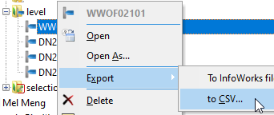
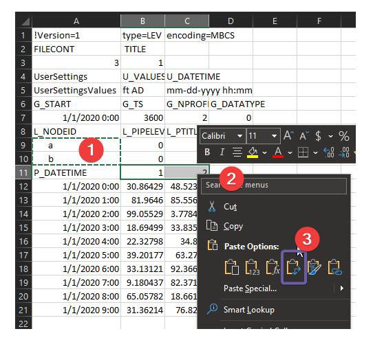
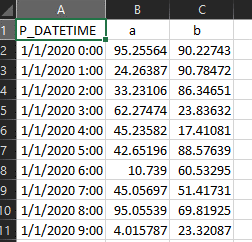
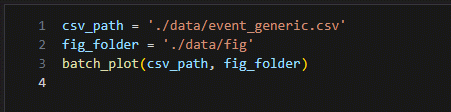
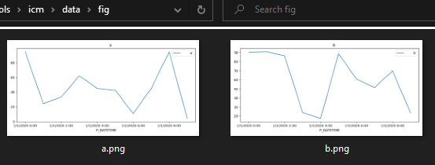

# batch_plot_event_file

For models with many nodes receiving inflows, or outfall nodes with boundary level conditions, it can get tedious reviewing the time series.

The “batch_plot_event_file.ipynb” provides a quick way to batch plot each time series as a figure so that you can quickly check them.

To plot the figures,

1.  export the event file as an “CSV” file

2.  open the exported csv file and prepare it as a generic csv file. In the exported csv file, the time series data can be found at the end, row 11 is the header, and the following rows are the values. We need to replace the column header in row 11 with actual profile name listed in row 9 and 10,

    1.  copy the profile names

    2.  select the column header

    3.  use paste special to transpose the profile names as column header

3.  delete the rows above the header, we’ll have a generic csv file.

4.  run the notebook after updating the csv_path to the generic csv file, and the folder for the folder,

5.  each profile will have a figure saved in the figure folder

