# Processing Rainfall Data

# Introduction

For simulations using long-term historical storm rainfall data, the collection and processing of rainfall data into a model-friendly format can be a tough task. This article provides an in-depth guide to clean and process rainfall data.

# Collecting rainfall data

In this article, we only focus on point rainfall collected by a rain gauge. Although Radar rainfall is measured using very different mechanisms, most of the methods discussed here still applies. A [tipping bucket rain gauge](https://www.youtube.com/watch?v=w3PBNu-dQTE) is a mechanical device that counts the number of times the bucket tips. Each tip counts a fixed volume of rainfall collected.

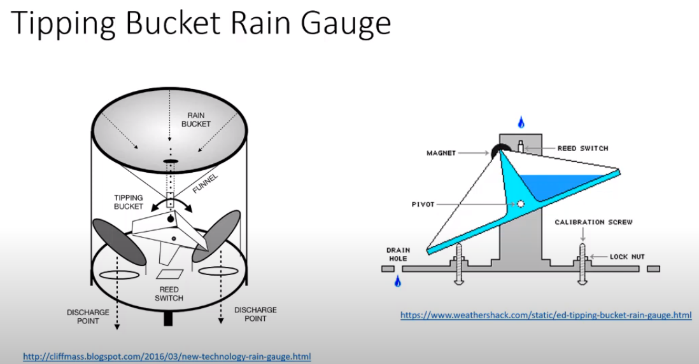

A data logger then reads the measurement and saves the results at fix intervals, for example, every 15 minutes. Below is an example of the data downloaded from a rain gauge.

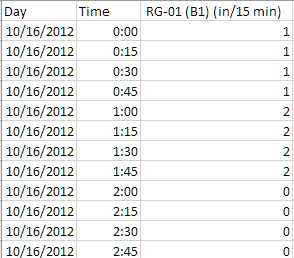

# Intensity vs Volume

The volume measured by the rain gauge is often converted to rainfall intensity, how fast the rain fills a bucket (the derivative of rainfall volume) in the unit of in/hr or mm/hr.

- the green line is the total rainfall volume, representing the total depth of rainfall since the beginning in inches.

- The intensity of the rainfall is the calculated as the average intensity between the readings. The difference between the two readings divided by the time interval (15min show in the figure) in inch/hr is shown as the blue intensity line.

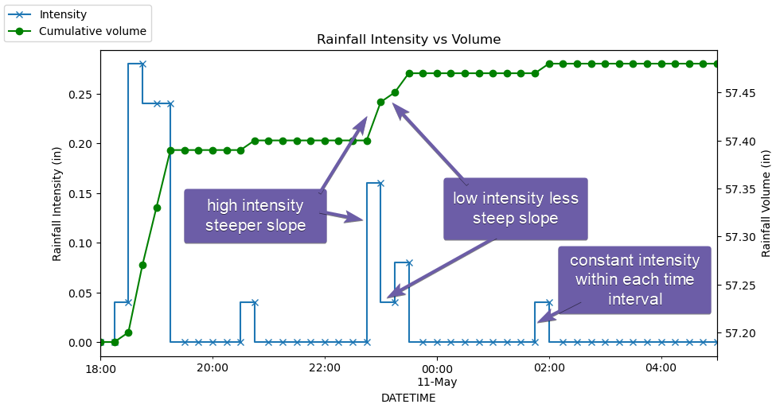

Representing rainfall intensity might feel strange because commonly we assume rainfall intensity is a step function instead of a smooth function. As shown below, for any two consecutive readings, we can calculate the average rainfall intensity between the two readings, and the result is a “step” between the two points.

And this will introduce ambiguity when rainfall is provided as intensity, it is up to the software package to make assumptions how to use the rainfall data. As shown in the figure here, we assumed the intensity is assigned to the end of each period. But most software will assume the intensity is assigned to the beginning of each period, a mismatch will cause the rainfall to shift by a time step. For rainfall data with 5 minutes interval, it will not cause too big a difference, however, for rainfall data with a 1 hour time interval, the shift will be noticable.

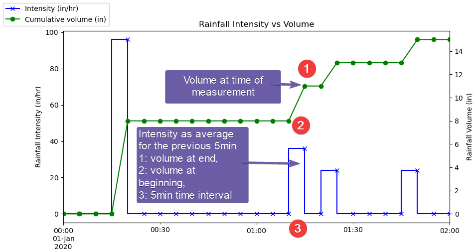

# Time interval complications

The most complicated part of processing rainfall data is changing the time series time intervals. Ideally, we would like to have time series data with timestamp at regular intervals, for example, at 0, 5, 10.. minutes.

However, real-world data can be messy. Here are a few examples,

- Variable time intervals. The data logger might not be able to consistently save data at exact time intervals, the reading could be off a few minutes.

- To reduce file sizes, some rainfall data remove all the 0 reading rows.

- Different time intervals. Old rainfall data collected with different time intervals than more recent records.

# Rainfall resampling

As we just explained, rainfall intensity is a step function, therefore simple linear interpolation cannot be used when we are resampling the rainfall data with different time intervals.

To overcome this challenge, you need to convert intensity to cumulative rainfall before resampling rainfall.

Resampling rainfall data to a new time interval can solve a wide range of rainfall data issue,

- Align the time stamps to a fixed interval.

- Merging rainfalls with different time intervals

There are 3 common types of resampling,

- Align irregular time intervals to fixed intervals.

- Up sampling (increase frequency): from 15 minutes interval to 5 minutes

- Down sampling (decrease frequency): from 5 minutes to 15 minutes interval

In general, we don’t want to do down-sampling as you lose information in the process. This impact is illustrated in this example,

- we have 2 rain gauges for the same storm (blue reads every 5 min, orange reads every 15 min)

- As the cumulative volume shows, for the 15 minutes readings, it will skip the readings at 5 and 10 minutes.

- As a results, the intensity calculated for each 15 minutes interval will be the average of the whole 15 minutes.

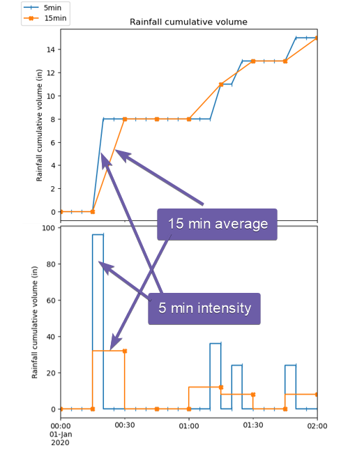

The resampling is done in the following steps,

- Calculate the cumulative curve (CC)

- Resample the CC at the new interval using linear interpolation

- Calculate the intensity from the resampled CC using the new interval

When up-sampling the rainfall (using smaller time steps), the shape of the rainfall doesn’t change, you simply add more points on the rainfall curve for smaller time steps.

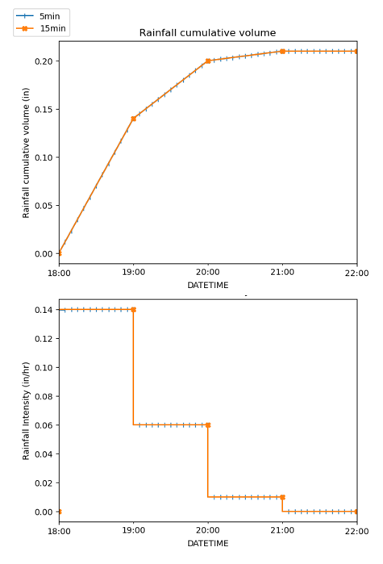

# Irregular time stamp

When aligning irregular time interval to a regular time interval, we use the same approach, linearly interpolate the cumulative curve to the new time intervals, then calculate the intensity.

As shown in the example, when aligning the time step, if the new interval doesn’t line up very close, the shape of the cumulative curve can also change significantly. The reason is if the new time step missed the turning point of the original curve, then the slope of the new curve will be different, therefore the intensity will be different.

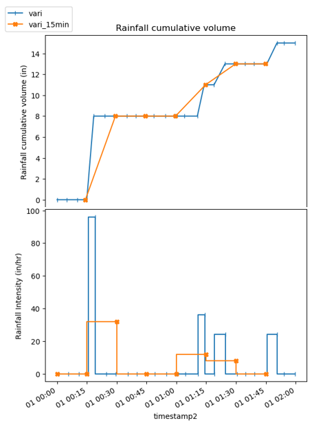

# Python Example

Refer to the [Jupyter notebook](https://github.com/mel-meng/hhnote/blob/main/hydrology/rainfall/rainfall.ipynb) for the calculations in python.

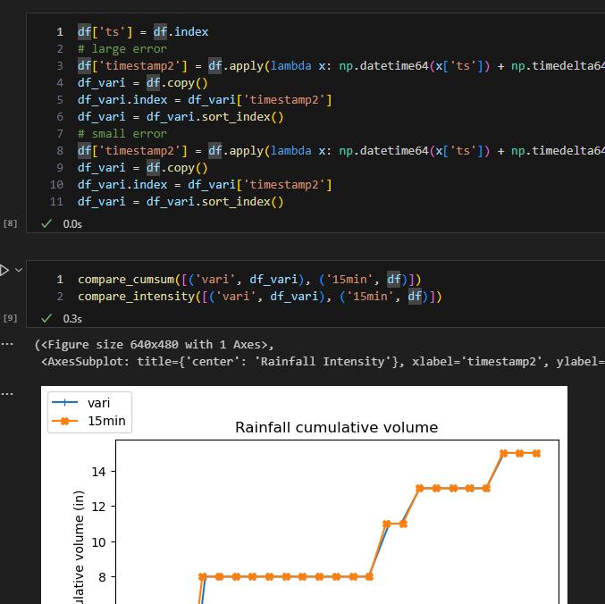

# Example worksheet

In the sample [worksheet](https://github.com/mel-meng/hhnote/blob/main/hydrology/rainfall/rainfall.xlsx), there are 3 examples of resampling rainfall,

- Down sampling: from 5min to 15 min

- Up sampling: from 5min to 1min

- Align time step: from random time interval to 15 min

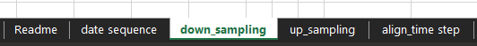

All the resampling examples are using the same calculations,

1.  Paste the time and volume into column A and B, volume is in inch, which is the rainfall between the two readings. To avoid confusion, the first row reading it set as 0.

2.  Column C, D, E are calculated from the current and previous readings for duration(min), intensity (in/hr) and cumsum (in) for cumulative rainfall starting from the time of the first row.

3.  For the resampled rainfall, paste the new timestamps in column I,

    1.  Column J interpolates the cumulative values based on column A and E

    2.  Column K, L, M calculates the duration (min), volume (in) and intensity (in/hr) for the resampled rainfall

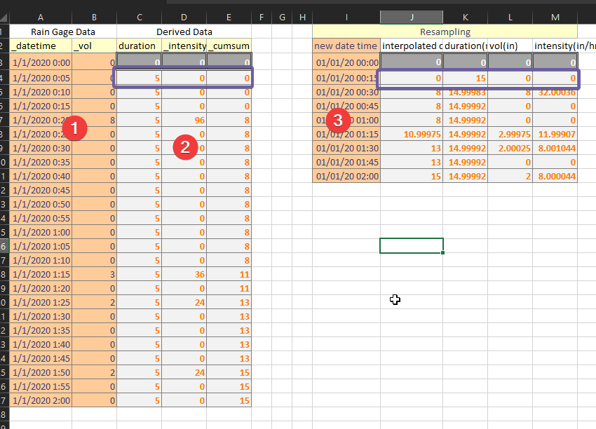

# Tips for Excel

Excel is widely used for time series processing. Here are a few useful tips.

## Date Time formats

Excel will not convert text to number or date if the cell value has a preceding apostrophe.

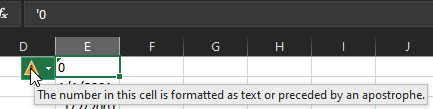

Although Excel can automatically convert date time text into a date data type, it is better to define it manually so that you know for sure it is the required [format](https://support.microsoft.com/en-us/office/format-numbers-as-dates-or-times-418bd3fe-0577-47c8-8caa-b4d30c528309#bm2).

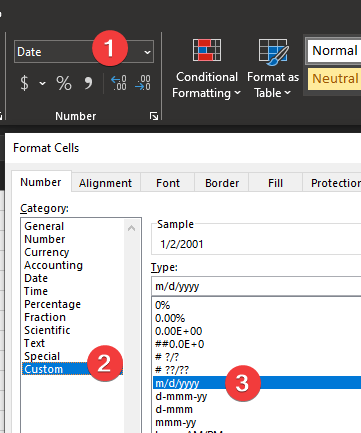

## Generating time sequence

Two ways to generate time sequence,

- Use the auto fill

- Use a formula

You can easily create a fixed interval time sequence by first entering the first two timestamps, then drag to fill the sequence.

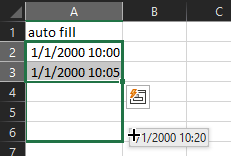

You can also add the time interval to the previous row to generate the sequence, the interval is a number in days, 5/24/60 will add 5 minutes to the previous row.

## Date time conversions

Date and time are represented as a number in Excel, you can use simple math for date time calculations.

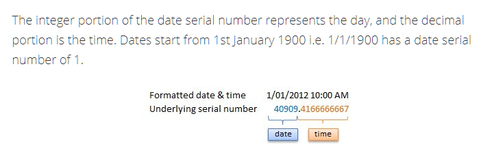

Combine date and time into a single column is as simple as adding them together

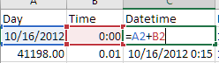

Use the TEXT function to extract different part of a datetime value,

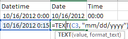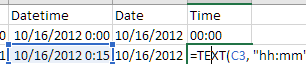

## Linear interpolation of time series

Excel doesn’t have a dedicated function that will do linear interpolation of a new time series from another time series. The formula that works is quite long and hard to prepare. The basic idea is to find the two points that your new point sits between, then use the forecast function to do a linear interpolation between the two points. Refer to this [article](https://exceloffthegrid.com/interpolate-values-using-the-forecast-function/) for more details how to use INDEX/MATCH/FORECAST to achieve that.

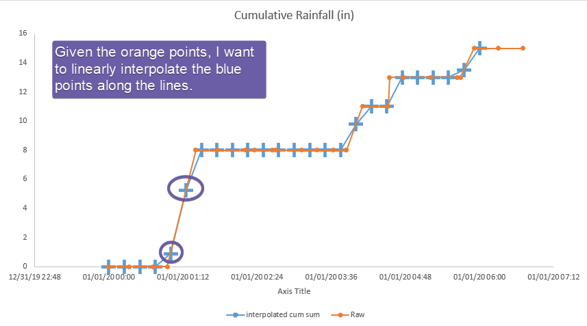

# Conclusion

In conclusion, processing rainfall data is a complex but crucial task. The complications related to time intervals such as variable intervals, zero readings, and different time intervals add to the complexity of the task. Resampling rainfall data to a new time interval is a solution to many of these issues. The process of resampling involves calculating the cumulative curve, resampling it at the new interval, and calculating the intensity from the resampled cumulative curve. This guide provides a detailed framework and examples to tackle the challenges in processing rainfall data.
