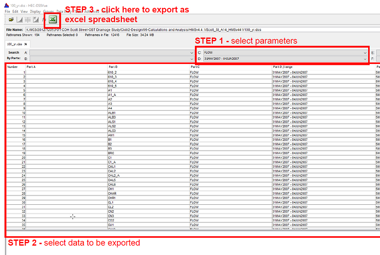
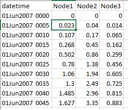
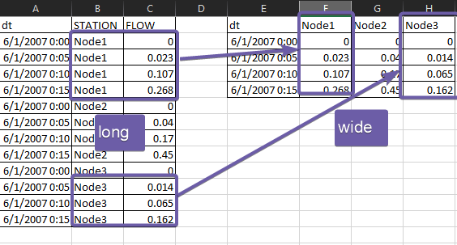
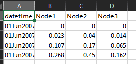
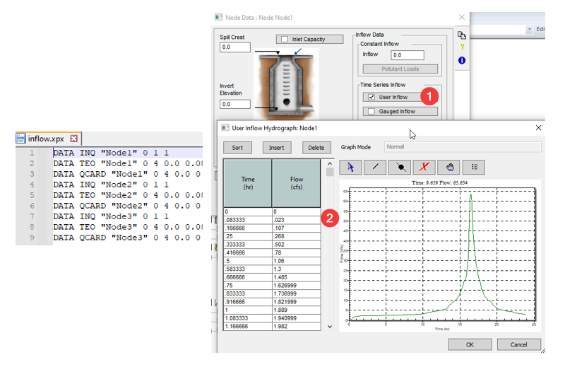
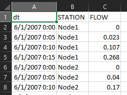
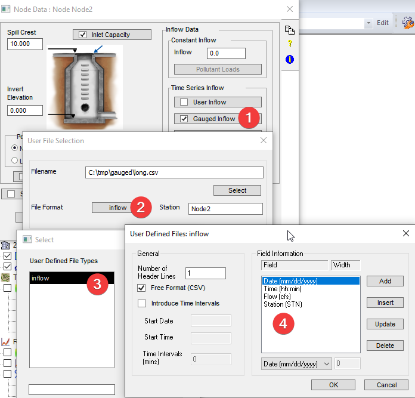
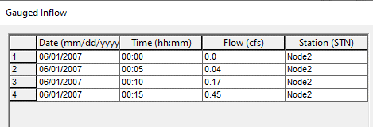

# Introduction

In the United States, HEC-HMS is widely used to generate the hydrographs from subcatchments when building stormwater and flood control models. Then the hydrographs are routed in a hydraulics package such as InfoWorks ICM and XPSWMM.

For models with hundreds of subcatchments, copying hydrograph manually can be very tedious. In this article, we’ll go through a few examples of converting the hydrographs from a csv file into several commonly used file formats.

# Install python

If you don’t have python on your computer, Anaconda makes installing python easy. Here is the [<u>download link</u>](https://www.anaconda.com/products/individual#windows). Either 64-bit or 32-bit should work.

# Save HEC-HMS time series to CSV

This csv file can be easily created from HEC-HMS using HEC-DSSVue. Open the exported excel file and remove the extra rows and columns.

# Processing the HEC-HMS CSV file

The format is shown in the figure, each column is a hydrograph for a node. The header should match node names exactly. The first column is the time stamp, and it should be called datetime and the format should look like the following.

Typical processing of time series data includes,

- Use a different date time format for time stamp

- Calculate the time passed since a starting point for each row

- Convert between long and wide format

## Use a different date time format for time stamp

There are many formats to choose from for date time,

- Mon 01 Jan 2001, 10:20AM (%a %d %b %Y, %I:%M%p)

- 01Jan2001 1020 (%d%b%Y %H%M)

- 01/01/2001 10:20 (%m/%d/%Y %H:%M)

- 2001-01-01 10:20:36 (%Y-%m-%d %H:%M:%S)

Refer to the [python documentation](https://docs.python.org/3/library/datetime.html#strftime-strptime-behavior) for more details on the format codes.

datetime.strptime('31/01/22 23:59:59.999999','\*\*%d\*\*/%m/%y %H:%M:%S.\*\*%f\*\*')

datetime.datetime(2022, 1, 31, 23, 59, 59, 999999).strftime('\*\*%a\*\* \*\*%d\*\* %b %Y, %I:%M%p')

\#'Mon 31 Jan 2022, 11:59PM'

## Calculate the time passed since a starting point for each row

Sometimes, instead of a time stamp, the time passed since the beginning of the simulation is required to define a time series. For example, XPSWMM inflow, rainfall requires this format.

## Long vs wide format

Time series are commonly arranged in two formats, the long and wide format.

- The long format saves each time series as a column.

- The wide format saves all the values in the same column and adds a “station” column so that you can filter the time series.

# Run the scripts

Download the “004 HECHMS TIME SERIES” folder from [<u>Github</u>](https://github.com/innovyze/Open-Source-Support/tree/main/01%20InfoWorks%20ICM/03%20Python/004%20hechms%20time%20series). If you are using Anaconda, start “spyder”. Open hms_csv_tools.py and run the script.

 

Go to the “data” folder to review the results,

- hms.csv: the input HECHMS time series

- hms2.csv: add “dt” and “hour” to the hms.csv

You can import flows from this file into InfoWorks ICM,

- long.csv: the long format

- inflow.xpx: XPSWMM inflow time series in xpx format

- gauged.xpx: XPSWMM using gauged inflow, getting data from external csv file.

Importing this xpx file will add the references to the external csv to each node.

