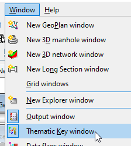
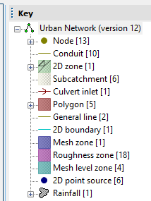
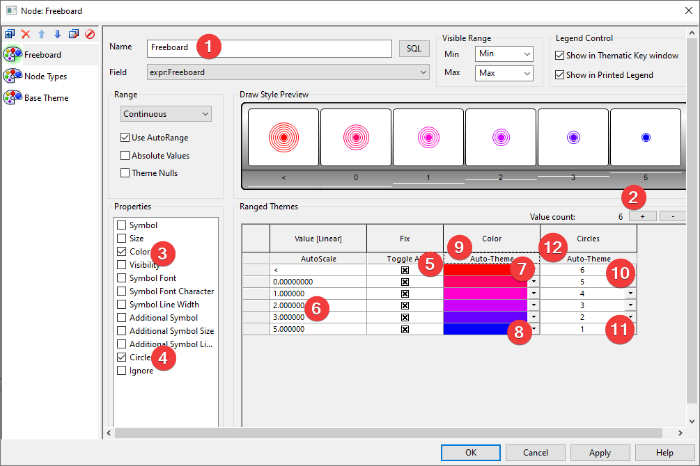
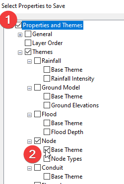
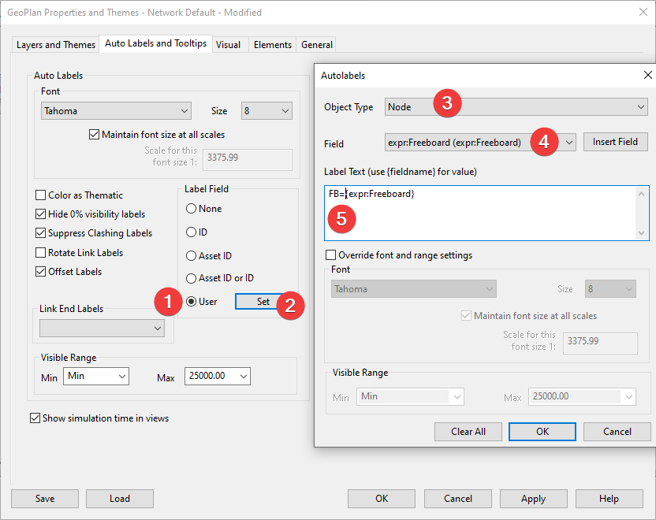
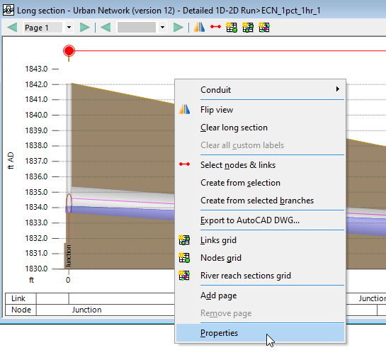
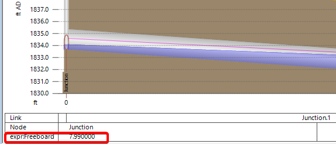
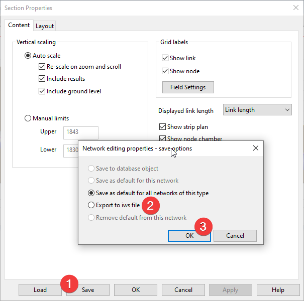

# Introduction

To calculate and visualize parameters that are not reported as an attribute or results field in InfoWorks ICM, you can use SQL expression to create a custom field.

For example, freeboard is measured as the distance from the ground of the manhole to the water level inside. Defined as a SQL expression in the network, it can be used as:

- symbol of circles (the closer to the ground the more circles) on the map (GeoPlan)

- symbol of circles on the profile

- label of the freeboard on the map

- label of the freeboard on the long section

# Add the SQL expression

Dragging the result into the GeoPlan.

Then open the “Key” window.

 

Open the node theme definition by double clicking on the node in the “Key” window.

In the Node theme window, add a new SQL Expression,

Enter the calculation in the SQL window, use the field type to switch between node attributes and result attributes (note: FIXED is a function the round the results to 2 decimal places.). Refer to the help pages for more details:

- [Node Results Data Fields](https://help.autodesk.com/view/IWICMS/2024/ENU/?guid=GUID-18FD4962-1E97-491A-AD6E-6DF35191301D)

- [Node Data Fields (InfoWorks)](https://help.autodesk.com/view/IWICMS/2024/ENU/?guid=GUID-18DCDEB6-621C-4127-8C04-365D3CDC4C7E)

- [SQL in InfoWorks ICM](https://help.autodesk.com/view/IWICMS/2024/ENU/?guid=GUID-F416C0A8-90BC-47F0-9A38-18FBEF65EFB8)

- [Edit Expressions Dialog](https://help.autodesk.com/view/IWICMS/2024/ENU/?guid=GUID-E5FF8FBF-1EA5-4836-98AE-178EBC6302FD)

# Add the GeoPlan (map) theme

For nodes with small freeboard, we would like to show a symbol as a large red circle. For nodes with a large freeboard, we would like to show it as a small blue circle.

Here are the 12 steps to create the symbols.

Notes:

- The first column “Value” defines the scale intervals for each symbol, corresponding to the “Draw Style Preview window”. To change the number of intervals, click on the “+/-“ sign in (2). To change the interval first toggle all the intervals (5), then change the values (6)

- Color and size ramps can be automatically interpolated between the first and last values. For the color ramp, (7) select color for worst case, (8) and green for best case, and (9) click on the auto-theme button to interpolate the rest.

# Save the theme as an object of file

For complex or commonly used themes, you can save it as a ICM object or a \*.iws file for later use.

To save a theme, you need to go to the GeoPlan Properties and Themes window, then click the “save” button.

There are several choices,

- Save to database object: a theme object saved to the current database tree. If you often need to change how the map looks, you should use this option.

- Save as default for all networks of this type: next time you open a similar network, the saved theme will be applied rather than the default theme. If you don’t change the map themes often, use this option.

- Export to iws file: export the theme to an external file. This can be a great option for sharing the themes.

- Remove default from this network: this is a rarely used option to remove the default themes.

The following steps are similar if you export the theme. To save to database object,

1.  Select the folder where the object will be saved

2.  Give it a name

3.  Check the filter option if you only want to save the theme for one object type

4.  Select the theme to be exported. (1) uncheck all the items. (2) select the theme to be exported.

# Apply a saved Theme

Drag and drop the saved theme to a GeoPlan will apply the theme to the opened network.

# Show the freeboard label on the GeoPlan

First go to “Properties and Themes” window, then click on “Auto Labels and Tooltips” tab. Then add the SQL expression to the label text. For more information, refer to [Custom Autolabels Text Dialog](https://help.autodesk.com/view/IWICMS/2024/ENU/?guid=GUID-E3E52C96-8654-460C-A017-1BBB0345AC21).

# Show the label on the long section

To show the long section profile, select the pipes, then use the long section tool to open the profile.

Next go to the properties,

Next turn on the freeboard label.

And the freeboard will show on the profile table.

# Save the long section settings

Similar to the Geoplan theme, you can also export the long section settings as an iws file.

# Conclusion

Using SQL expressions in GeoPlan allows you to create custom fields and visualize the results. This tutorial guides you through the process of adding and applying custom themes, as well as saving and applying saved themes. By following these steps, you can enhance your data visualization and analysis capabilities in GeoPlan.
