# Introduction

You can create beautiful maps without leaving InfoWorks ICM using the built-in GeoPlan tools. In the sample transportable database, you’ll find a long list of commonly used themes. To make your own map, all you need is to drag and drop the theme you like from the sample group to your own model.

Under the Themes model group, symbols of nodes, links and other objects are organized into major objects groups,

- Node: for manholes

- Conduit: for pipes

- 2D: for surface flow

- Applications: themes for all modeling objects

- Autolabels: labels for objects

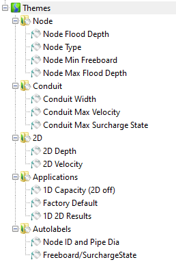

If you are using an earlier version of the database, you can load the \*.iws files from the “iws files” folder.

# Review the themes

You can review the themes using the sample models,

1.  First download the Model.icmt and Themes.icmt

2.  Copy the models and themes into your database

3.  Run the simulation

4.  Open the results

5.  Drag the theme into the GeoPlan

**TIPS: Ctl + drag theme object into GeoPlan to apply theme without overwriting existing themes.**

To review the settings of the themes,

1.  Open the key window

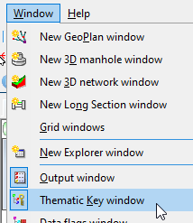

2.  Double click on the theme item to open the Theme settings

3.  For Autolabels, check the label tab for more information

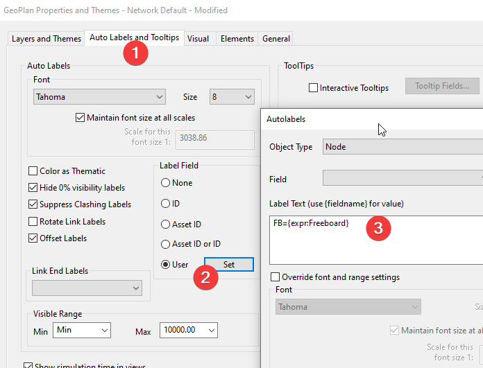

# Themes List

## Node

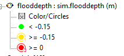

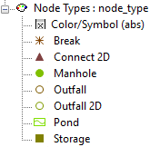

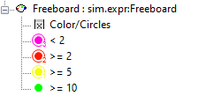

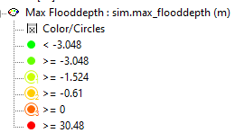

## Conduit

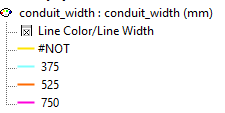

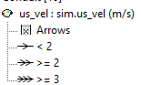

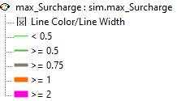

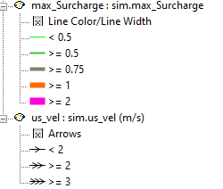

## Applications

1D results only

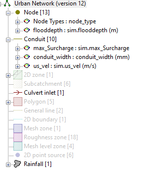

1D/2D results

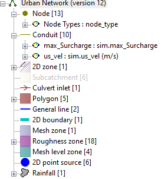

## Autolabels

To show autolabels, first turn it on for the layer.

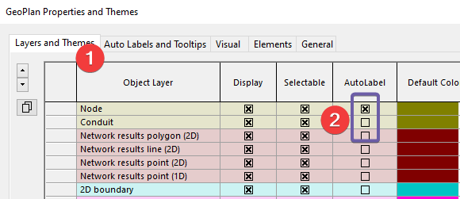

Node name and diameter

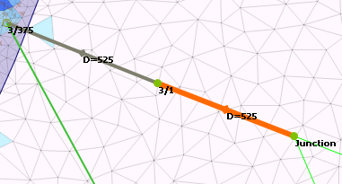

Results

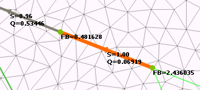
