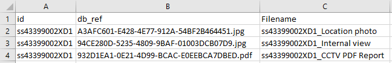

# Renaming Exported Attachment Files
Within the InfoAsset Manager you can export images and attachment files which are stored against an object using the standard export methods available.

When exporting these attachment files, they are exported with a GUID filename - which is what they are stored using within the Master Database.
Currently there is no built-in utility to rename/define a file's filename when exporting from the database.


The scripts here will resolve this, allowing bulk renaming of files using a simple CSV mapping file.


## Renaming Already Exported Files
 Script: **UI-FileRename_v2.rb**

 The prerequisite of using this script is a CSV file which contains at least two columns - one which has the file's current filename (full filename including file type extension) & a column with the new filename (without file type extension), and that the files to be renamed are all located within one folder.


 For example, I have the below CCTV Survey with some attachments.

 


 I export the object ID, the file reference - to export the file itself, and the proposed new filename - either generated using SQL/Script.

 


 Note, that because these attachments are a blob field, to generate the proposed filename I had to use a Script callback class (on line 3) - see the [0001A ODEC Callback Examples](https://github.com/innovyze/Open-Source-Support/tree/main/02%20InfoAsset%20Manager/01%20Ruby/0001A%20ODEC%20Callback%20Examples) repository for examples such as this.
```
    class Exporter
      def Exporter.Filename(obj)
          return obj['id']+'_'+obj['attachments.purpose']
      end
    end
```


 So that I have a simple CSV file as below which I can use to rename the files as well as the files themselves.

 


 Then I can run the script using the InfoAsset Manager interface, when prompted selecting the folder where the files are, the mapping file, and the headers of the current & new filenames.

 


 Hey presto, the files are renamed to something more meaningful.

 


Note on renaming, the script is set to prevent overwriting of files by means of renaming a file to a filename already in use within the folder.
If this happens, the Script Output will show a log the current and proposed filenames for your separate investigation.