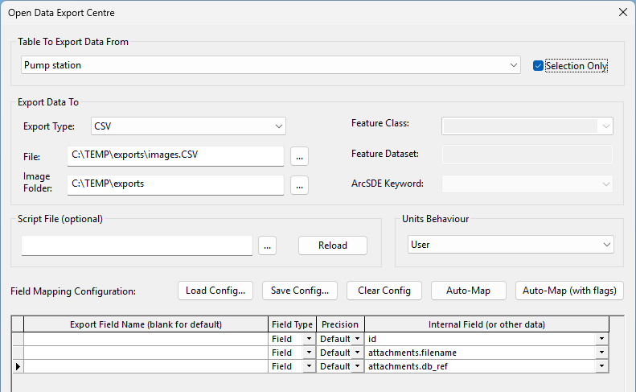
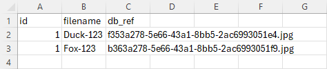
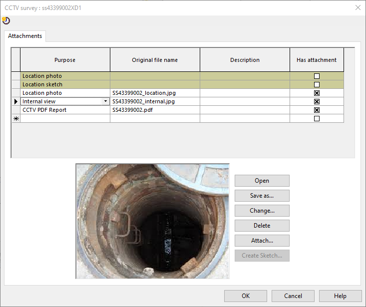
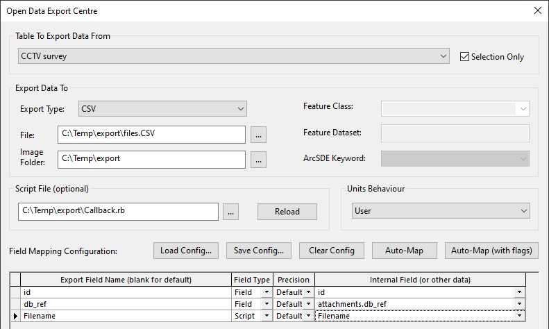
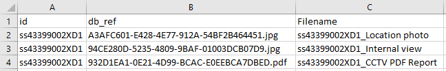
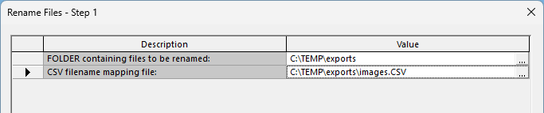
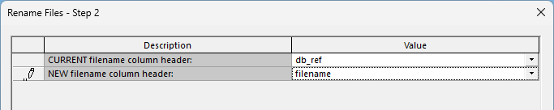
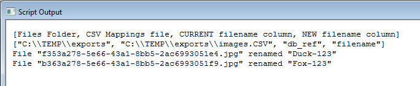
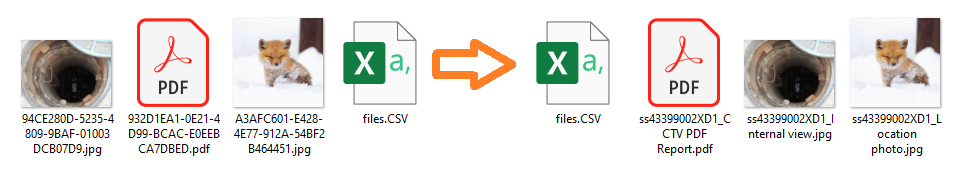

# Renaming Exported Attachment Files

Within the InfoAsset Manager you can export images and attachment files which are stored against an object using the standard export methods available.  

When exporting these attachment files, they are exported with a GUID filename - which is what they are stored using within the Database.

The script is designed to prevent overwriting of files by means of renaming a file to a filename already in use within the folder.  
If this happens, the Script Output will try and append the new filename with an index number based on the line in the CSV[^1].  The outputted log will detail the file renamings which have occured.  
Rows that cannot be renamed (for example, when the source file is missing or the proposed new name is invalid after sanitisation) are skipped and reported in the Ruby console rather than stopping the script.  
Note, we cannot be held liable if the script does overwrite any files.  
[^1]: Handling of multiple proposed filenames being the same is in v4 & later of this script.  

## Exporting the files and using the 'Original Filename' field for the new filename

To simply export the files and rename them to the value in the 'Original Filename' (attachments.filename) field.  

1. Use the Open Data Export Centre to export at least the attachments.filename & attachments.db_ref fields. The db_ref field is the database field currenlty holding the file.  
  
*ODEC, exporting the attachments and original filename field.*  

2. This will export the images, along with the current filename and what we propose to rename the files.  
  
*CSV export in Excel.*  

3. Run the script [as detailed in the Run the Ruby Script section](#Run-the-Ruby-Script).  

## Exporting the files and creating a filename using a Callback Class

For example, I have the below CCTV Survey with some attachments.  
  
*Attachments dialog for a CCTV Survey.*  

1. I export the Object ID, the file reference - to export the file itself, and the proposed new filename - either generated using SQL/Script.  
  
*ODEC, exporting only the necessary fields.*  

Note, that because these attachments are a blob field, to generate the proposed filename I had to use a Script callback class (on ODEC line 3) - see the [0001A ODEC Callback Examples GitHub repository](../0001A%20ODEC%20Callback%20Examples/) for examples such as this.  
The Callback class syntax I used in this example is:  

```ruby
class Exporter
    def Exporter.Filename(obj)
        if !obj['attachments.purpose'].nil?
            name=obj['id']+'_'+obj['attachments.purpose']
            return name.gsub(/[^0-9A-Za-z _-]/, '')
        else
            name2=obj['id']
            return name2.gsub(/[^0-9A-Za-z _-]/, '')
        end
    end
end
```

Essentially what it is doing is returning the object value for the id field, followed by an underscore character, then the attachments.purpose field value concatenated together if the purpose field has a value, else it is just outputting the Object ID.  
The returned string then has any characters removed that are not alphanumeric, spaces, underscores, or hyphens. The rename script applies further sanitisation when renaming files.  

2. So that I have a simple CSV file, as below, which I can use to rename the files as well as the files themselves.  
  
*CSV export in Excel*  

3. Run the script [as detailed in the Run the Ruby Script section](#Run-the-Ruby-Script).  

## Renaming Already Exported Files

Script: **[UI-FileRename_v4.rb](./UI-FileRename_v4.rb)**  

The prerequisite of using this script is a CSV file which contains at least two columns - one which has the file's current filename (full filename including file type extension) and a column with the new filename (without file type extension), and that the files to be renamed are all located within one folder.  

When renaming, the script sanitises proposed new filenames to remove characters that are not permitted on Windows file systems. Any extension included in the new filename column is stripped before the source file's extension is appended.  

### Run the Ruby Script

1. Run the script using the InfoAsset Manager interface (**Network** > **Run Ruby script...** > select [UI-FileRename_v4.rb](./UI-FileRename_v4.rb)). The script uses two prompts:  
2. **Rename Files - Step 1** — select the folder containing the exported files and the CSV mapping file.  
  

3. **Rename Files - Step 2** — select the current and new filename columns from dropdown lists populated from the CSV headers.
  

4. Review the Ruby console output for any rows that were skipped (missing source file, invalid new name, or duplicate target name).  
  
*Script Output in InfoAsset Manager*  

5. Like magic, the files are renamed to something more meaningful as defined in the CSV. :satisfied:  
  
*Files pre and post renaming*  