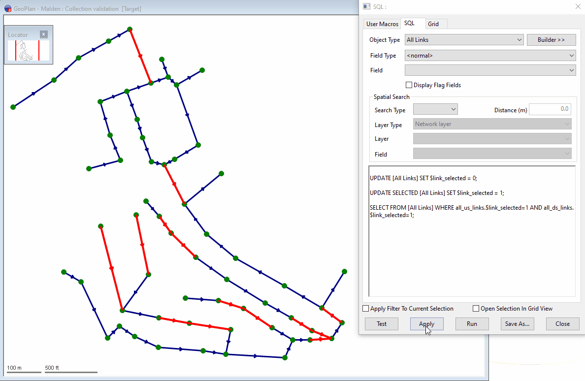

# Network Tracing using SQL
## [Trace_Upstream.sql](./Trace_Upstream.sql)
A simple Upstream trace from one or more selected **Nodes**.  
A prompt dialog will appear to set the maximum number of links to trace upstream - it is recommended to be restraint in the number entered, tracing for long distances via SQL is inefficient.  

### [Trace_UpstreamDownstream.sql](./Trace_UpstreamDownstream.sql)
The same as Trace_Upstream.sql from one or more selected **Nodes**, but with the prompt dialog giving the choice of trace direction - upstream or downstream.  

### [Trace_UpstreamDownstream-ExcludePipeStatus.sql](./Trace_UpstreamDownstream-ExcludePipeStatus.sql)
The same as Trace_UpstreamDownstream.sql from one or more selected **Nodes**, extended to include a choice of *pipe_status* field value to ignore and not select/trace past.  

### [Trace_UpstreamDownstream-SelectCCTV-Report.sql](./Trace_UpstreamDownstream-SelectCCTV-Report.sql)
Similar to Trace_UpstreamDownstream.sql, once the traced Pipes are selected the current selection will be extended to include related CCTV Surveys, then output a grid of values from the CCTV Surveys selected.  
This SQL runs from selected **Link(s)**.  

## [Trace_IntermediateLinks.sql](./Trace_IntermediateLinks.sql)
Within InfoAsset Manager, there is a tool to select the path between two Nodes (GeoPlan > Tracing Tools > Intermediate Paths) - but this only works from a current selection of 2 Nodes.  
With a current selection of at least **2 Pipes**, extend the selection to also include any intermediate Pipes.
. 