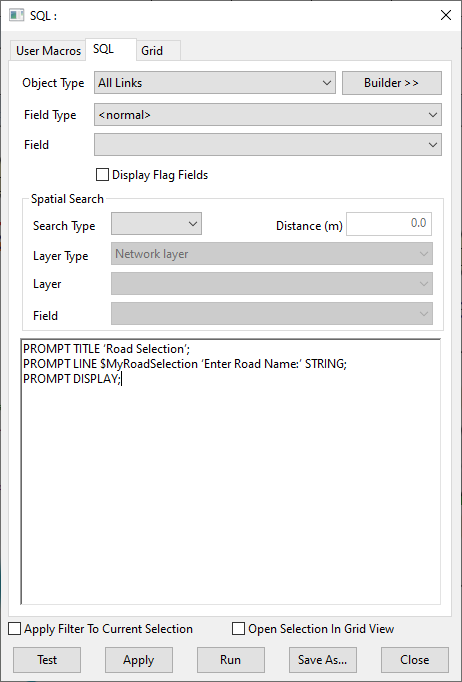
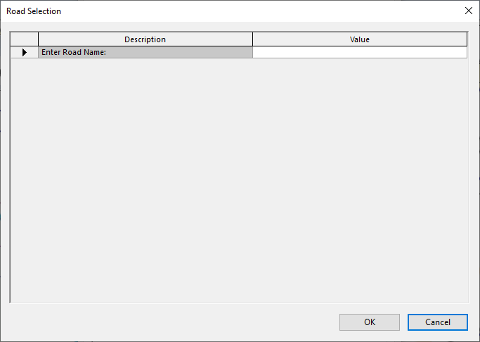
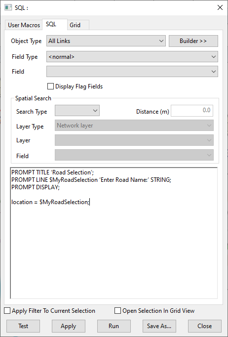
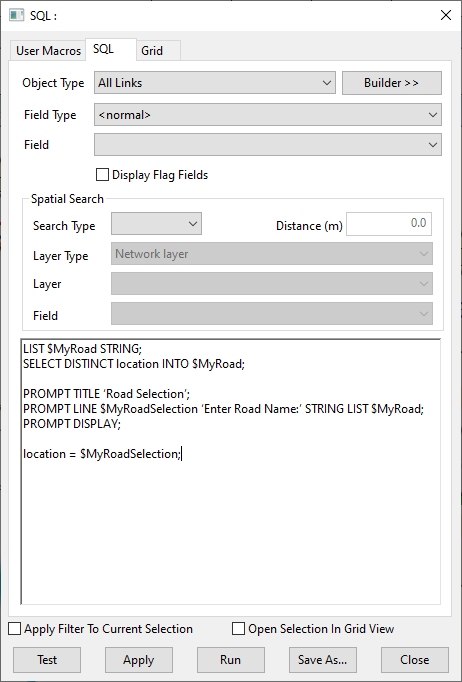
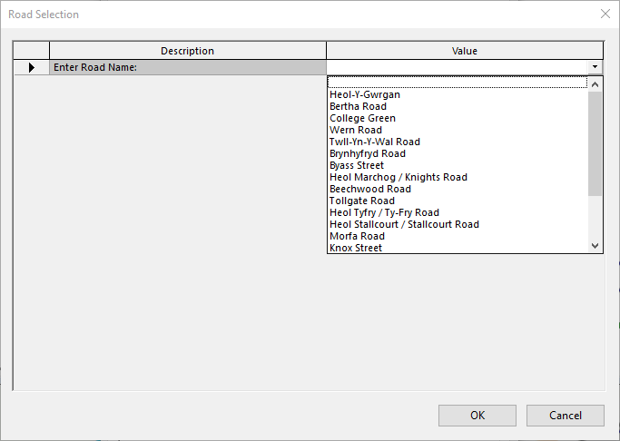

The SQL functionality within InfoAsset Manager, so underused yet so very useful, especially when you can make it interactive by use of the `PROMPT` Keywords.  
In this article we’ll try to dissect the syntax and demonstrate how to use a `PROMPT` dialog box.  
We’ll also try to go a bit further and explain how to generate lists of unique values extracted from an objects fields and embed this list in the `PROMPT` dialog.  

Try typing:  
`PROMPT DISPLAY;`  
… into an SQL dialog box and hitting apply, see what happens!
A dialog box is generated… “So what?” you may be thinking, “I can’t do anything with this”. Well, not yet…  

Try the following:  
`PROMPT TITLE 'Road Selection';`  
`PROMPT LINE $MyRoadSelection 'Enter Road Name:' STRING;`  
`PROMPT DISPLAY;`

  
*The SQL dialog with the PROMPT syntax.*  

Note the changes to the dialog box. As well as the cosmetic change to the dialog box’s title defined by the first line;  

`PROMPT TITLE 'Road Selection';`  

… now renamed ‘Road Selection’ from the default ‘SQL Prompt Dialog Box’, notice that there is now a line in the prompt, into which the user can type. This has been generated from the following line of code;  

`PROMPT LINE $MyRoadSelection 'Enter Road Name:' STRING;`  

The line has been defined of type `STRING`. A value that is entered into this line is then stored in a variable. Variables in SQL all begin with the '$' symbol and in this case I’ve defined my variable by giving it a name '$RoadSelection'.  

The variable can then be used after the ‘`PROMPT DISPLAY;`’ line.  
This line is a natural break in the code and is the point at which the code stops, and is awaiting the user’s interaction. The user can thus enter a value in the dialog box line and hit the ‘OK’ or ‘Cancel’ buttons.  
The ‘Cancel’ button stops further execution whilst the ‘OK’ button executes any lines of code after the ‘`PROMPT DISPLAY;`’ line.  

  
*SQL Prompt dialog.*  

The following is a simple example to complete the SQL:  
`PROMPT TITLE 'Road Selection';`  
`PROMPT LINE $MyRoadSelection 'Enter Road Name:' STRING;`  
`PROMPT DISPLAY;`  

`location = $MyRoadSelection;`  

  
*The SQL dialog with the PROMPT syntax.*  

… Here we see the last line `‘location = $MyRoadSelection;’` as the one that is doing the work, in this case making a selection by comparing the value entered by the user and stored in variable `‘$MyRoadSelection’` and comparing it to the values in the ‘location’ field and making a selection of an object if the values are the same.  

OK, so now for a bit of smart code to make the SQL that extra bit special. Try the following:  
`LIST $MyRoad STRING;`  
`SELECT DISTINCT location INTO $MyRoad;`  

`PROMPT TITLE 'Road Selection';`  
`PROMPT LINE $MyRoadSelection 'Enter Road Name:' STRING LIST $MyRoad;`  
`PROMPT DISPLAY;`  

`location = $MyRoadSelection;`  

  
*The SQL dialog with the PROMPT syntax.*  

Note the addition of two lines and a change to the fourth.  
`LIST $MyRoad STRING;`  
`SELECT DISTINCT location INTO $MyRoad;`  

The addition of the above lines defines a string list variable named `$MyRoad`. It then populates this with the unique values found in the ‘location’ field. Note also that this list has to be included into the `PROMPT LINE`, I’ve highlighted the change to the original below.  
`PROMPT LINE $MyRoadSelection 'Enter Road Name:' STRING LIST $MyRoad;`  

The `PROMPT` now includes a drop down combo box containing the unique road names from the location field – Awesome!!!  

  
*SQL Prompt dialog with a dynamic choice list.*  
