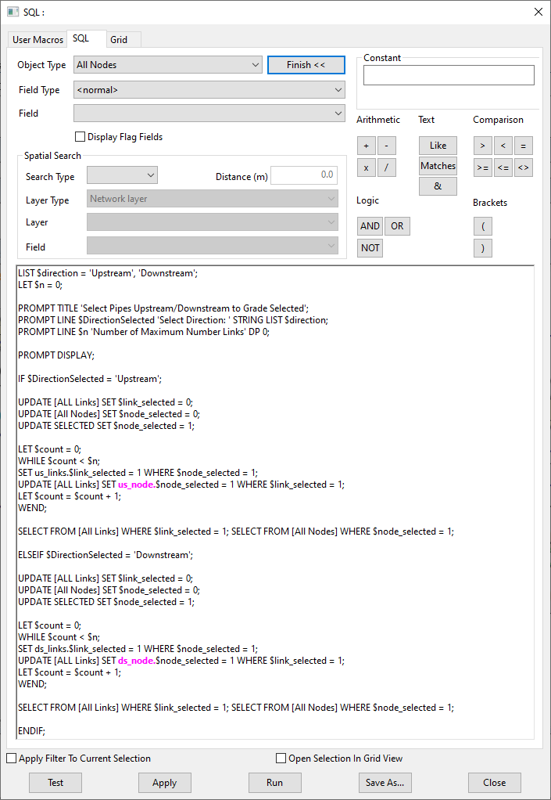
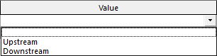
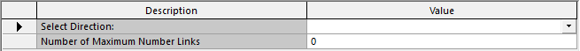
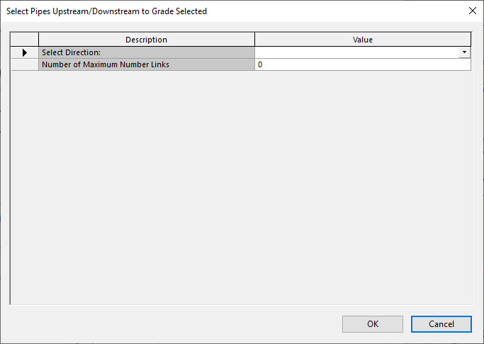
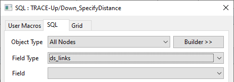

# Introduction
Continuing from another post on SQLs ([InfoAsset Manager Smart SQL – Dynamic Lists for Prompt Dialogs](../0101%20Dynamic%20Lists%20for%20Prompt%20Dialogs/readme.md)). We're going to explore SQLs further using the prompt dialog box as well as introducing some new concepts.  

The SQL presented in this article will select a number of user specified pipes either upstream or downstream from a selected node or nodes. We will start off by presenting the code in it’s entirety and then dissecting it, presenting the working parts…  

  
*SQL Dialog to trace upstream or downstream.*  

See the full syntax we are going to be discussing in [sql_query.sql](./sql_query.sql).  
… agreed that is indeed quite a lot of code, but let’s break it down.  

## 1. Creating the variables.
`LIST $direction = 'Upstream', 'Downstream';`  
`LET $n = 0;`  
This couple of lines of code will create and initialise two variables which we’ve called $direction and $n. These will be used in the PROMPT dialog box, that is created using the next few lines of code.  

## 2. Creating the PROMPT Dialog box.
`PROMPT TITLE 'Select Pipes Upstream/Downstream to Grade Selected';`  
`PROMPT LINE $DirectionSelected 'Select Direction: ' STRING LIST $direction;`  
`PROMPT LINE $n 'Number of Maximum Number Links' DP 0;`  
` `  
`PROMPT DISPLAY;`  
These four lines create a `PROMPT`. The first line is simply cosmetic to give the prompt a title.  
  
*SQL Prompt dialog with a custom title.*  
The second and third lines of code add lines to the prompt dialog box.  

The second line uses the `$direction` variable, which enables a drop down combo box. This is achieved by defining the line as such using the following `STRING LIST` and qualifying it with the `$direction` variable.  
  
*Prompt dialog List.*  
The value chosen is then saved to the `$DirectionSelected` variable to be used later.  
  
*The Prompt dialog variables.*  

The third line of code allows the user to enter a value which is stored in variable $n to be used later. By default the line allows numerical values to two decimal places, however the DP 0 changes this to entry of an integer numerical value.  
And the forth displays the dialog awaiting user input.  
  
*The Prompt dialog as a whole.*  

## 3. Where the good stuff happens.
Notice that there are two lines in the code that start `IF` and `ELSEIF`. Each of these start a block of code that end in `WEND`. Scrutiny of the code reveals that the block of code proceeding the `IF` and `ELSEIF` is almost identical.  

… `IF` block  

`IF $DirectionSelected = 'Upstream';`  
` `  
`UPDATE [ALL Links] SET $link_selected = 0;`  
`UPDATE [All Nodes] SET $node_selected = 0;`  
`UPDATE SELECTED SET $node_selected = 1;`  
` `  
`LET $count = 0;`  
`WHILE $count < $n;`  
`SET us_links.$link_selected = 1 WHERE $node_selected = 1;`  
`UPDATE [ALL Links] SET us_node.$node_selected = 1 WHERE $link_selected = 1;`  
`LET $count = $count + 1;`  
`WEND;`  

…and `ELSEIF` block  

`ELSEIF $DirectionSelected = 'Downstream';`  
` `  
`UPDATE [ALL Links] SET $link_selected = 0;`  
`UPDATE [All Nodes] SET $node_selected = 0;`  
`UPDATE SELECTED SET $node_selected = 1;`  
` `  
`LET $count = 0;`  
`WHILE $count < $n;`  
`SET ds_links.$link_selected = 1 WHERE $node_selected = 1;`  
`UPDATE [ALL Links] SET ds_node.$node_selected = 1 WHERE $link_selected = 1;`  
`LET $count = $count + 1;`  
`WEND;`  

The differences in these blocks appears in the line beginning `SET` and `UPDATE` and is the relational table to the node that has been selected.  
  
*The SQL dialog Object and Field options.*  

The block of code is executed depending on the selection made by the user in the `PROMPT` dialog box. Either the `IF` or `ELSEIF` bloc is run, never both. The work and selection of objects is made by the lines within the block. Lets examine the lines within a block, i.e. those between `IF` and the first `WEND`.  

## 4. Selecting the objects.
Selecting the objects is done by the following line:  
`SELECT FROM [All Links] WHERE $link_selected = 1; SELECT FROM [All Nodes] WHERE $node_selected = 1;`  

… after the block has been executed.  

`UPDATE [ALL Links] SET $link_selected = 0;`  
`UPDATE [All Nodes] SET $node_selected = 0;`  
`UPDATE SELECTED SET $node_selected = 1;`  
` `  
`LET $count = 0;`  
`WHILE $count < $n;`  
`SET us_links.$link_selected = 1 WHERE $node_selected = 1;`  
`UPDATE [ALL Links] SET us_node.$node_selected = 1 WHERE $link_selected = 1;`  
`LET $count = $count + 1;`  

The block runs through a `WHILE` loop, which stops after a number of iterations. The number of iterations is determined by the value held by $n, which is the input specified by the user. The clever part here is that a temporary variable `$link_selected` is attached to the, in this case, upstream objects and is pushed up the line during each iteration. This is to say a tag is applied to an object which propagates in the direction specified.  
This tag is then used to make the selection.  

## 5. Finishing off.
`ENDIF;`  
Since we started an `IF`, `ELSEIF`… we need to close out with an `ENDIF`.