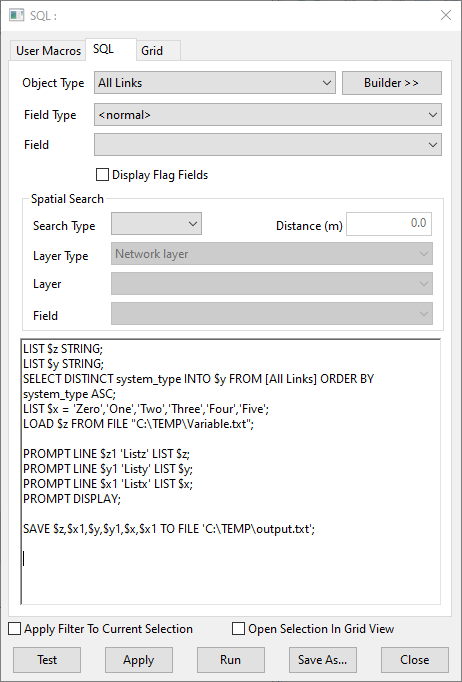
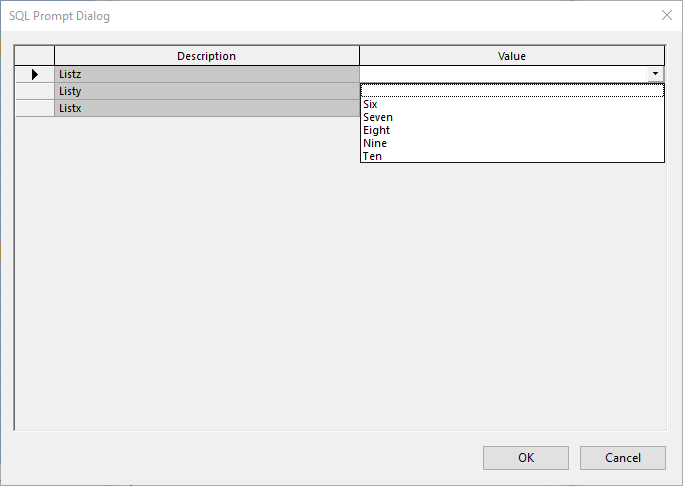
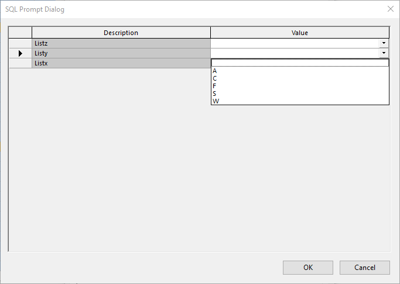
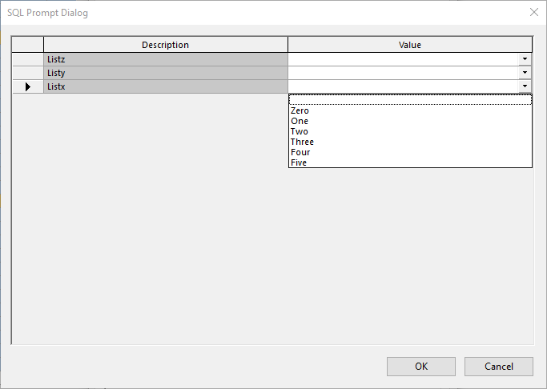

# Introduction
List variables are used in conjunction with a number of functions, known as 'list variable functions'. You can find full information about these functions in the "SQL in InfoAsset Manager Technical Paper", either from the IAM in-built Help file or from the [Online Help](https://help.innovyze.com/display/infoassetmanager/InoAsset+Manager+Online+Help) [copy of the Technical Paper](https://help2.innovyze.com/infoassetmanager/index.html#HTML/TechNotes/SQL_in_InfoWorks_ICM%20and%20InfoNet.htm%3FTocPath%3DTechnical%2520Notes%7C_____2#List_Variables).  
Variables can be populated using three primary methods; defining within the SQL syntax, populating from network values, or loading from a file.  


## Setting a Variable via SQL syntax
LIST variable_name = list of values (separated by commas) e.g.  
``` SQL
LIST $widths = 100, 300, 500, 700, 900 
LIST $codes = 'AB', 'AF', 'BC', 'BD' 
```
The variable name must be valid as described above, beginning with the dollar sign. The equals sign must be there, as must the commas between the individual values. As well as numbers and strings it is possible to have lists of dates, which as described above must begin and end with the # character.  
It is possible to declare a list variable but not to set any values by saying:  
LIST $widths  
LIST $codes STRING  
LIST $calendar DATE  
These declare lists of numbers, strings and dates respectively.  


## Populating a Variable from the Network
A variable can be populated from network values using the SELECT method in conjunction with INTO to push the values into the variable instead of as an output.  
In this example there is also the use of DISTINCT to only populate the variable with one-of-each potential value from the field, as well as ORDER BY to make the list be presented in ascending order.  
```SQL
SELECT DISTINCT system_type INTO $y FROM [All Links] ORDER BY system_type ASC;
```


## Loading a Variable from File contents
A variable can also be populated by loading value from an external CSV/TXT file using the LOAD method. Before loading a variable from a file, you should define the list.  
```SQL
LIST $z STRING;
LOAD $z FROM FILE "C:\TEMP\Variable.txt";
```


#### The File Format
The values in the file must have the values horizontally with the first value on the line being the variable name called on to load. More than one variable list can be in the file on separate lines, hence stating the variable name to load.  
Example file contents:  
```
$z,Six,Seven,Eight,Nine,Ten
$q,1,3,5,7,9
```


### Saving List Variable to a File
Similar to saving a SELECT output into a file, the variables can be saved into a file – which will be the same format as the file which was required for loading the variable.  
```SQL
SAVE $z,$x1,$y,$y1,$x,$x1 TO FILE 'C:\TEMP\output.txt';
```


## Worked Example
In the [sql_query.sql](./sql_query.sql) example you will find all of the above in a single query.  
  
It will present a prompt dialog with the variables available to select, which are then outputted along with the selections into the file 'output.txt'.  
  
  
  