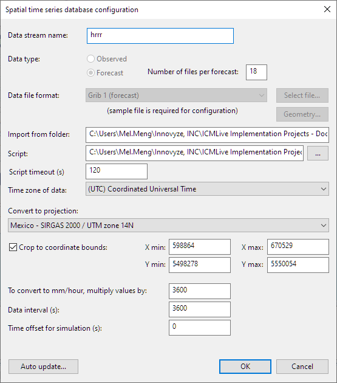

# Powershell script that downloads the HRRR weather forecast data for ICMLive.

For more information about working HRRR weather forecast data in ICM, refer to this [blog post](https://mel-meng-pe.medium.com/how-to-get-rainfall-forecast-into-tsdb-in-infoworks-icm-97faa6934abe).

To setup ICMLive to download hourly HRRR data:
* Create a `script` folder on the server
* Create a `data` folder on the server
* Update `hrrr.bat` with the input (see the file for more information)
   * Paths for `script` and `data`
   * Bounding box for the area
 * Setup the TSDB
   * The data format, etc
   * The auto update schedule
 * Data will be downloaded to the `data` folder
   * ICMLive when runs will load when all the 18 files are all ready, otherwise, it will skip all the files
   * Logging information is recorded in `hrrr.log`
   * Loaded data will be automatically moved to a `loaded` subfolder

## TSDB

A sample TSDB is shown below.

The auto update setting.

