# Introduction

This sample shows how to setup a scheduled task to download real-time
hourly spatial rainfall forecast for the next 18 hours from the [NOAA
HRRR](https://rapidrefresh.noaa.gov/hrrr/) site. NOAA uploads the
forecast for the next 18 hours every hour consisting of 18 files. This
enhanced version will run every 15 minutes to make sure all the 18 files
are downloaded for each hour. If you don’t need to continuously download
the data, you can manually run the script without setting up a scheduled
task.

Before getting started you’ll need to have the following,

-   A server that you can setup a scheduled task

-   The bounding box of the area for the rainfall data

-   Create the folders for the scripts and the downloaded files

-   (Optional) for automated modeling, setup a scheduled task to run the
    script every 15 minutes

-   Setup the spatial database for loading the HRRR data

-   (Optional) Setup the data loader to load the downloaded data into
    the system every 30 minutes

The main challenge with HRRR workflow is that ICMLive requires all the
data files to be downloaded for each forecast before it can be imported.
However, the time when all the files are ready to be downloaded can
change from hour to hour. Downloading the file over the Internet can
also pose some connection issues. Therefore, if we download the data
only once, we might not be able to get the full dataset.

To overcome these challenges, this script should be scheduled to run
every 15 minutes starting at 10min of each hour. This way, we try to
download the data 4 times at 10, 25, 40, 55min each hour. This should
overcome most of the issues if we only try to download the data once an
hour.

# Install the script

The script only uses PowerShell script and batch files, any windows
computer should support it.

1.  Create a script folder, and data folder. In this example, both under
    the sample folder

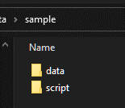

2.  Copy hrrr.bat and hrrr.ps1 to the script folder

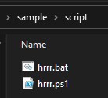

3.  Edit hrrr.bat as shown below

<!-- -->

1)  Setup the bounding box, you can get it in Google Maps by right click
    on the map, make sure there is no space before and after the “=”
    sign

> 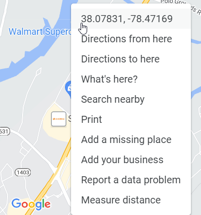 alt="Diagram Description automatically generated with medium confidence" />

2)  Update the folder where the hrrr files will be downloaded, make sure
    there are two slashes at the end

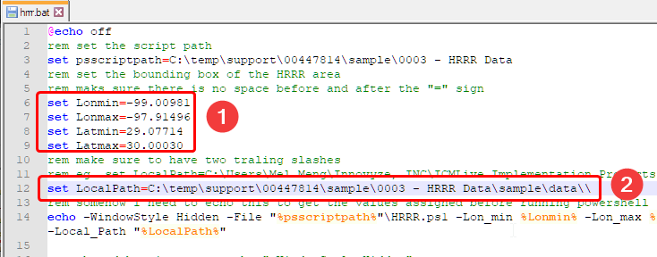

4.  Run the \*.bat file, you should see files starts to download in the
    data folder

>  alt="Graphical user interface, text Description automatically generated" />

5.  Check the log file, as shown below, it shows the files that are
    successfully downloaded, and the one that are not downloaded yet

> 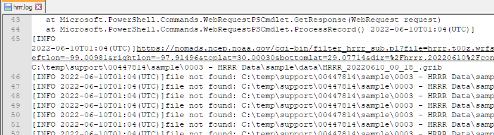 alt="Text Description automatically generated with low confidence" />
>
> When all the 18 files are downloaded, a text file with the prefix for
> the forecast will be created.
>
> 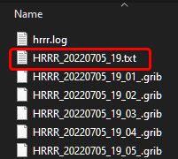 alt="Text Description automatically generated" />

6.  Setup a task scheduler

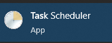

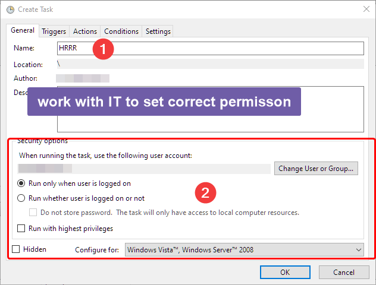

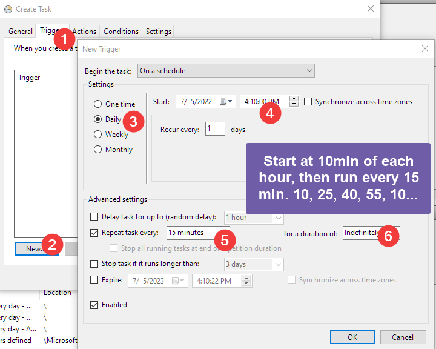

# Load the HRRR files into a TSDB

1.  Define the projection in GeoPlan

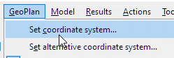

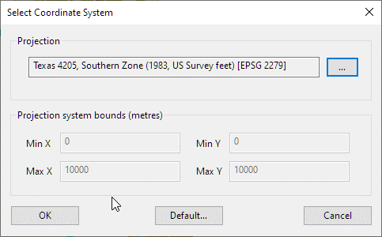

2.  Verify the projection using Google Maps

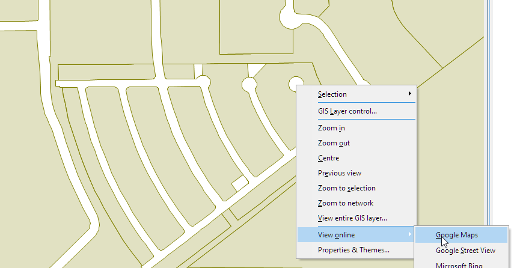

3.  Zoom to the extent for the rainfall (if you only need to load the
    rainfall for part of the downloaded HRRR files.)

4.  Create a spatial time series database

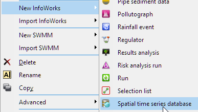

5.  Setup the TSDB

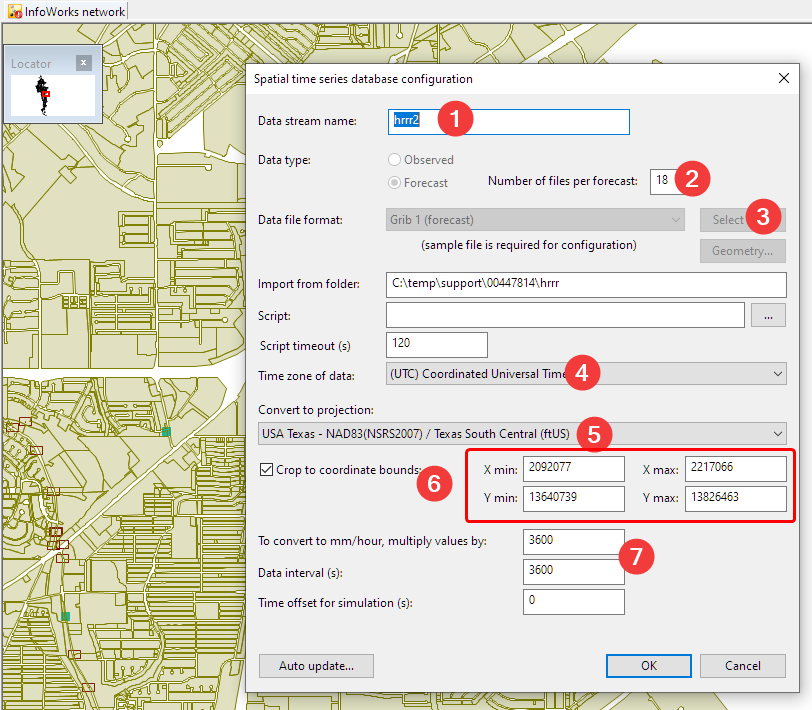

1.  Give it a name

2.  Depending how far into the future you need to run the model, maximum
    is 18.

3.  Select a sample file from the data folder

4.  HRRR uses UTC time

5.  Select the projection of the model network

6.  If you need to crop the data, check this option, and the easiest way
    to do it is to zoom to the area in the GeoPlan, TSDB will
    automatically pick up the coordinates.

7.  The conversion for imperial unit, and time interval is 1hr

8.  If you are using dataloader, setup the update schedule. It depends
    on how often you run the forecast simulation.

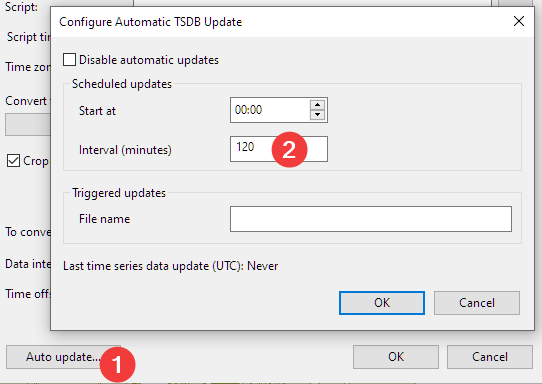

6.  Review the results

<!-- -->

1.  Open the network

2.  Turn on the radar cell

> 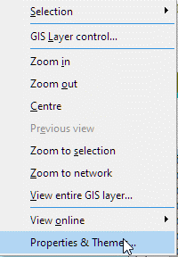 alt="Graphical user interface, application Description automatically generated" />
>
> 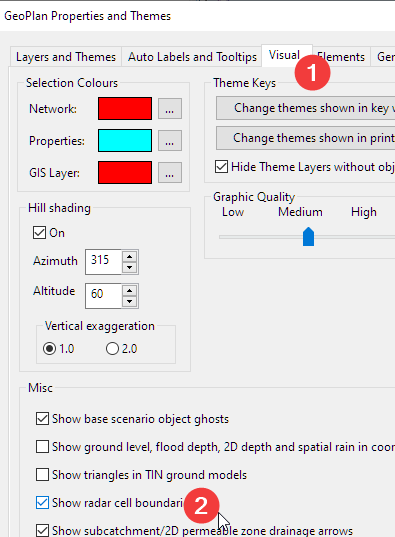 alt="Graphical user interface, application, website Description automatically generated" />

7.  Drag the TSDB into the GeoPlan

<!-- -->

1.  Graph the data to get some sense of the rainfall events.

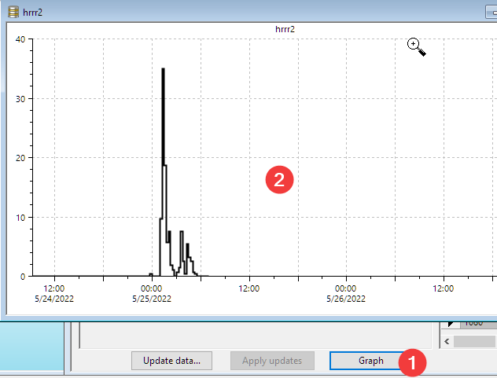

2.  Review the rainfall event

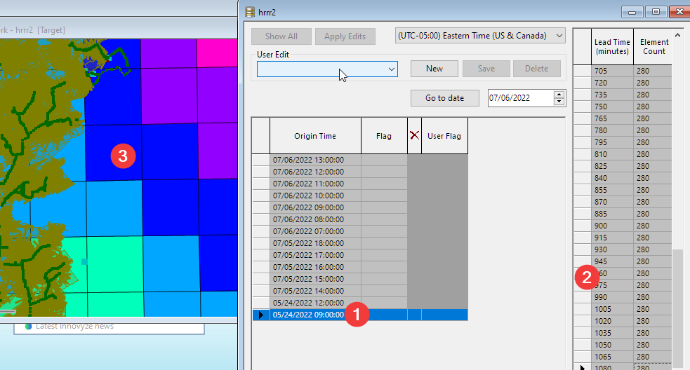

1.  Select a forecast

2.  Use arrow key to move through the forecast

3.  See the rainfall in the GeoPlan
