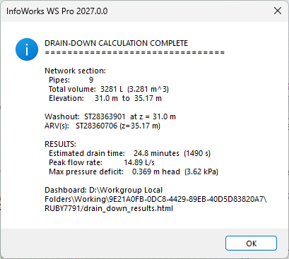
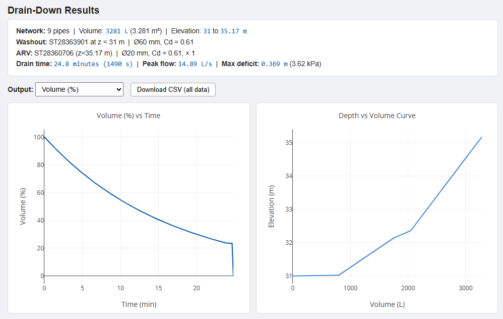

# Drain-Down Time Calculator for InfoWorks WS Pro

Estimates the gravity drain-down time for an isolated section of water distribution network. The script models the coupled hydraulics of water draining through a washout valve and air entering through Air Release Valve (ARV) nodes, using a quasi-steady time-step simulation with a bisection solver.

## How It Works

1. **Isolation trace** — starting from your selected pipe(s), the script runs an isolation trace to identify the full set of pipes and nodes that will drain
2. **Washout & ARV selection** — prompts you to choose a washout hydrant and confirm the ARV node(s)
3. **Volume-elevation curve** — builds a depth-vs-volume relationship from pipe diameters, lengths, and node elevations
4. **Time-step simulation** — at each step, solves for the pressure deficit (vacuum) such that the air admission rate through the ARVs equals the water drain rate through the washout
5. **Interactive dashboard** — outputs an HTML page with Plotly charts and a full CSV download

## Screenshots

### Summary Dialog

### Interactive Dashboard

The dashboard includes:
- **Dropdown selector** to view Volume (%), Volume (m³), Water Surface, Effective Head, Flow Rate, or Pressure Deficit over time
- **Depth vs Volume curve** showing the pipe network's storage profile
- **Download CSV** button exporting all time-series columns

## Requirements

- **InfoWorks WS Pro 2025 or later** (UI script)
- A network must be open (no simulation results required)
- At least one pipe selected in the section to drain
- Washout locations modelled as `wn_hydrant` objects
- ARV nodes flagged with `user_text_1 = 'ARV'` on `wn_node`

## Usage

1. Select one or more pipes in the section you want to drain
2. Run `drain_down_calculator.rb` from the Ruby scripting menu
3. If multiple washout hydrants are found, select exactly one
4. Confirm which ARV nodes to include (defaults to all flagged nodes)
5. Enter hydraulic parameters (valve diameters and discharge coefficients)
6. The HTML dashboard opens automatically; a summary dialog shows key results

## Hydraulic Parameters

| Parameter | Default | Description |
|---|---|---|
| Washout valve diameter | 100 mm | Internal diameter of the washout/hydrant valve |
| Washout valve Cd | 0.61 | Discharge coefficient for the washout orifice |
| ARV orifice diameter | 25 mm | Air inlet orifice diameter per ARV |
| ARV Cd | 0.61 | Discharge coefficient for air admission |
| Simulation time step | 10 s | Duration of each quasi-steady step |

## Physics

- **Water flow**: orifice equation — `Q_w = Cd_w × A_w × √(2g × h_eff)`
- **Air flow**: orifice equation (incompressible approximation) — `Q_a = Cd_a × A_a × √(2 × δ × ρ_w × g / ρ_a)`
- At each step, a bisection solver finds the pressure deficit `δ` where `Q_w = Q_a`
- Multiple ARVs act in parallel (combined orifice area)
- Plug-flow drainage assumed (no partial-full pipe HGL modelling)
- The incompressible air approximation is valid for small pressure deficits (δ < ~0.8 m head)

## Output Columns (CSV)

| Column | Unit | Description |
|---|---|---|
| `time_s` | s | Elapsed time |
| `volume_m3` | m³ | Remaining water volume |
| `volume_pct` | % | Remaining volume as percentage of initial |
| `water_surface_m` | m | Water surface elevation |
| `effective_head_m` | m | Driving head above washout (after vacuum deduction) |
| `flow_rate_Ls` | L/s | Washout discharge rate |
| `pressure_deficit_m` | m | Sub-atmospheric pressure (vacuum) at the air-water interface |
| `pressure_deficit_kPa` | kPa | Same deficit in kPa |
