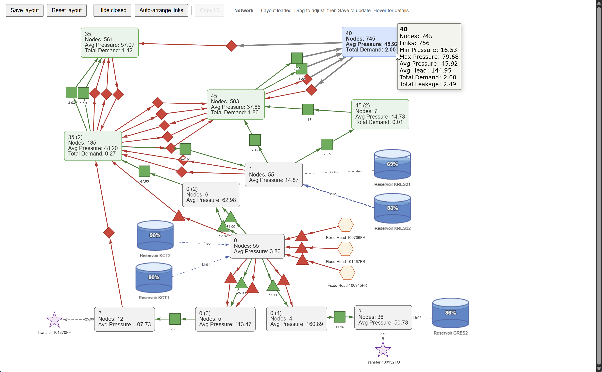

# Area Schematic Generator for InfoWorks WS Pro

Generates an interactive HTML schematic of a hydraulic network's pressure areas. The script traces through the network, identifies boundaries (valves, pumps, meters), and produces a drag-and-drop visualization using [vis-network](https://visjs.github.io/vis-network/docs/network/).



## Features

- **Automatic area tracing** — walks the network graph, splitting at boundary links (valves, pumps, meters) to identify distinct pressure areas
- **Area naming from model data** — reads the `area` field on links and uses the most common value per traced group; assigns `Area 1`, `Area 2`, etc. when blank
- **Simulation results** — displays average pressure and total demand on each area box; hover for min/max pressure, average head, total leakage, and link counts
- **Boundary link detail** — valves labelled by mode (PRV Valve, FCV Valve, Closed Valve, etc.) with flow annotations; pumps show flow, head, pumps on, and energy in tooltips
- **Reservoir fill levels** — cylinder graphics fill proportionally based on percent volume, with depth and load in tooltips
- **Fixed Head nodes** — displayed as orange hexagons with flow derived from connecting links
- **Transfer Nodes** — displayed as purple stars with demand-based arrow direction
- **Arrow direction** — edges point in the direction of flow for reservoirs, fixed heads, and transfer nodes
- **Area consolidation** — tiny areas (no demand, fewer than 5 links) attached to a reservoir, fixed head, or transfer node are automatically merged
- **Layout persistence** — positions are embedded in the HTML file; re-running the script reloads the saved layout so you can update results without re-arranging
- **Interactive toolbar** — Save layout, Reset layout, Hide closed links, Auto-arrange boundary links, Copy selected object ID

## Files

| File | Purpose |
|---|---|
| `zone_schematic.rb` | Main entry point — configuration, orchestration, layout extraction, HTML output |
| `zone_schematic_helpers.rb` | Pure utility functions (sanitize filename, safe result access, formatting) |
| `zone_schematic_network.rb` | Network tracing, area statistics, boundary detection, vis-network payload building |
| `zone_schematic_html.rb` | Generates the complete interactive HTML page with embedded JavaScript |

## Requirements

- **InfoWorks WS Pro 2025 or later** (runs as a UI script)
- A network must be open with simulation results loaded
- All four `.rb` files must be in the same folder

## Configuration

Open `zone_schematic.rb` and set the two options at the top:

```ruby
# Hard-code a path to skip the folder dialog, or set to nil to be prompted
OUTPUT_DIR = 'D:\Zone Schematics'

# Set to true to write the traced area name back to every link and node's
# 'area' field in the model. Boundary links, reservoirs, fixed heads, and
# transfer nodes are left untouched.
UPDATE_AREA_FIELDS = false
```

## Usage

1. Open your network in InfoWorks WS Pro and load simulation results
2. Run `zone_schematic.rb` from the Ruby scripting menu
3. Select an output folder (or let `OUTPUT_DIR` handle it)
4. The HTML opens automatically in your default browser
5. Drag nodes to arrange the schematic, then click **Save layout**
6. Re-run the script after new simulations — the saved layout is preserved

### Toolbar

| Button | Action |
|---|---|
| **Save layout** | Saves the HTML file with current node positions embedded |
| **Reset layout** | Clears saved positions and re-runs physics stabilization |
| **Hide closed** | Toggles visibility of closed (red) boundary links |
| **Auto-arrange links** | Repositions boundary link nodes to midpoints between their connected areas |
| **Copy ID** | Copies the model object ID of the selected node to the clipboard |

### Boundary detection rules

| Type | Condition |
|---|---|
| **Valves** | Any valve with a recognized mode (PRV, PSV, PCV, TCV, FCV, FRV, PFV, FMV, PRSV) or a closed THV |
| **Pump Stations** | All pump stations (`wn_pst`) |
| **Meters** | Only meters with a non-null `live_data_point_id` (Control data) |

## Symbols

| Shape | Meaning |
|---|---|
| Green box | Area with demand |
| Grey box | Area without demand |
| Green diamond/triangle/square | Open boundary link (valve / pump / meter) |
| Red diamond/triangle/square | Closed boundary link |
| Blue cylinder | Reservoir (fill level shown) |
| Orange hexagon | Fixed Head node |
| Purple star | Transfer Node |
