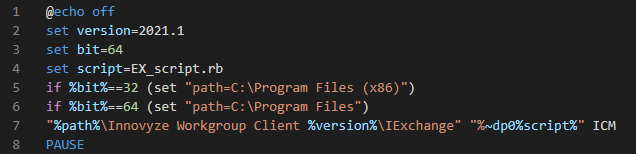

# Innovyze open source scripts
This repo will host open source code that can be used in the various Innovyze products. This includes Ruby for the UI/Exchange, SQL and other useful scripts.

The Exchange.docx documentation includs (almost) all available Ruby methods and will be updated regularly.

## Ruby
Ruby Scripts are split into those that run from the UI and those that run via the Exchange API. The differences between the two are explicit in the Exchange.docx documentation. In this Repo:
* Scripts that run from the **UI** will follow the nomenclature `UI_script*.rb`.
* Scripts that run from via the **Exchange API** will follow the nomenclature `EX_script*.rb`. These will also contain a `*.bat` file that triggers the script using a specific version of the Workgroup Client that can be customisable.

Multiple scripts performing a similar task can be stored under the same folder. These should be appended with the suffix `_v*`, where `*` is an integer representing each variant.
## Disclaimer
### Scope of code
Scripts posted here are generally developed by Innovyze Support on the back of a specific customer request. We're not computer scientists. Therefore, the scripts might not always be optimised, prettyfied, refactored, etc. Feel very welcome to contribute with pull requests and raise issues for code that you'd like to see here.

As a by-product it would be nice if this space reached enough critical mass that a community of like-minded programmers would help each other, suggest improvements and propose new ideas.

This is not the place to develop bespoke code for customers, nor ever will we post it here. This can be requested from Innovyze within the scope of an implementation project.

### Structure
This project is currently growing in a rather organic fashion. We might decide do change the structure, which might mean broken links. We'll try to avoid this as best as possible, but this can happen more frequently especially during the early stages of the project.

### Liability
Innovyze Support will post and moderate code posted here in good faith. This is open source and is available for anyone to interrogate what it does. **Innovyze is not liable for unintended consequences of code posted her, nor does it have a responsibility for maintaining it.**