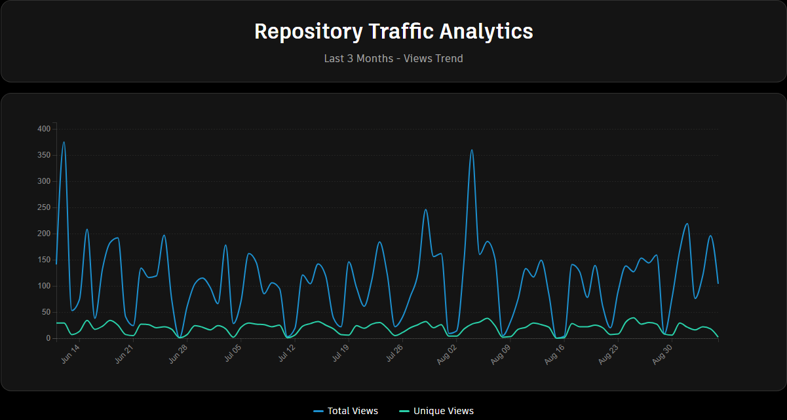

# 📊 Traffic Data Analytics Dashboard

An interactive, real-time analytics dashboard for tracking GitHub repository traffic using D3.js visualization.

## 🚀 Live Dashboard

View the dashboard by opening `index.html` in a web browser (requires local web server - see Local Development section below).



*Interactive charts showing repository views and clone trends over time*

## ✨ Features

- **📈 Interactive Time Series Charts** - Visualize total and unique views/clones with smooth animations
- **🎯 Real-Time Statistics** - Key metrics including total views, unique visitors, and peak traffic days
- **🕒 Flexible Time Ranges** - View data for 30 days, 90 days, 1 year, or all time
- **💫 Responsive Design** - Works beautifully on desktop, tablet, and mobile devices
- **🎨 Autodesk-aligned UI** - Black/white surfaces, Artifakt type stacks, and restrained tertiary chart colors
- **📊 Hover Tooltips** - See detailed data points by hovering over the charts
- **📉 Insights Page** - Year-over-year comparisons, monthly tables, and clone-rate analysis
- **🏁 Milestones Page** - Repository milestones with context chart, filtering, and expandable cards

## 📁 Project Structure

```
traffic-analysis branch (repo root)
├── index.html              # Daily traffic dashboard
├── insights.html           # Insights dashboard
├── milestones.html         # Milestones dashboard
├── README.md               # This file
├── assets/
│   ├── brand/
│   │   ├── favicon.svg
│   │   └── og-card.png
│   ├── css/
│   │   └── styles.css      # Shared dashboard styling
│   ├── images/
│   │   └── preview.png
│   └── js/
│       ├── app.js          # Daily traffic application logic
│       ├── chart.js        # Chart rendering module
│       ├── config.js       # Configuration constants
│       ├── dataLoader.js   # Data loading utilities
│       ├── insightsApp.js  # Insights page logic
│       ├── insightsEngine.js
│       ├── milestonesApp.js
│       └── utils.js        # Helper functions
├── data/
│   ├── views.csv           # Views data (auto-updated weekly)
│   ├── clones.csv          # Clones data (auto-updated weekly)
│   └── milestones.json     # Milestone metadata
├── docs/
│   ├── generate-preview.html   # README preview generator (uses shared styles.css)
│   └── generate-og-card.html   # OG card generator (standalone token literals)
└── tests/
    └── brand-contract.test.mjs # Brand token contract checks
```

## 🔄 Automated Data Collection

This repository uses GitHub Actions to automatically collect traffic data:

- **Schedule**: Runs weekly (every Sunday at 23:55 UTC)
- **Action**: Uses [repository-traffic-action](https://github.com/innovyze/repository-traffic-action)
- **Updates**: Automatically commits new data to `data/views.csv` and `data/clones.csv` on the `traffic-analysis` branch
- **Dashboard**: Automatically displays updated data on page refresh

## 🛠️ Technology Stack

- **D3.js v7** - Data visualization library
- **Vanilla JavaScript** - No frameworks, pure ES6 modules
- **CSS3** - Autodesk brand tokens with solid surfaces and responsive layout
- **GitHub Pages** - Free hosting
- **GitHub Actions** - Automated data collection

## 📊 Data Sources

Traffic data is collected from GitHub's Traffic API:

- **Views**: Daily total and unique page views
- **Clones**: Daily total and unique repository clones
- **History**: Data available since March 2021

## 🚀 Local Development

To run the dashboard locally:

1. Check out the `traffic-analysis` branch and clone the repository:
   ```bash
   git clone https://github.com/moreird/Open-Source-Support.git
   cd Open-Source-Support
   git checkout traffic-analysis
   ```

2. Start a local web server (required for loading CSV files):
   ```bash
   # Using Python 3
   python -m http.server 8000 --bind 127.0.0.1
   
   # Or using Node.js
   npx http-server -a 127.0.0.1
   ```

3. Open your browser to `http://127.0.0.1:8000`

4. Run brand contract tests:
   ```bash
   node --test tests/brand-contract.test.mjs
   ```

## 📸 Generating Preview Images

To regenerate README and social preview assets:

1. Start a local web server from the repo root (CSV loading requires HTTP):
   ```bash
   python -m http.server 8765 --bind 127.0.0.1
   ```
2. Open `http://127.0.0.1:8765/docs/generate-preview.html`, wait for the chart to render, and capture `#preview` as `assets/images/preview.png`. This page links the shared `assets/css/styles.css` palette and typography.
3. Open `http://127.0.0.1:8765/docs/generate-og-card.html`, wait for the chart to render, and capture `#ogCard` at 1200×630 as `assets/brand/og-card.png`. This standalone page duplicates official Autodesk token literals inline because it does not load the shared stylesheet.

## 📝 License

This project is open source and available for use.

## 🤝 Contributing

Contributions, issues, and feature requests are welcome!

---

**Last Updated**: Automatically via GitHub Actions  
**Dashboard Version**: 1.0.0

